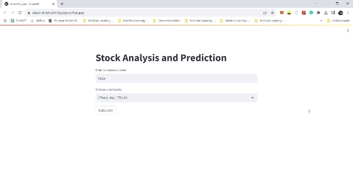
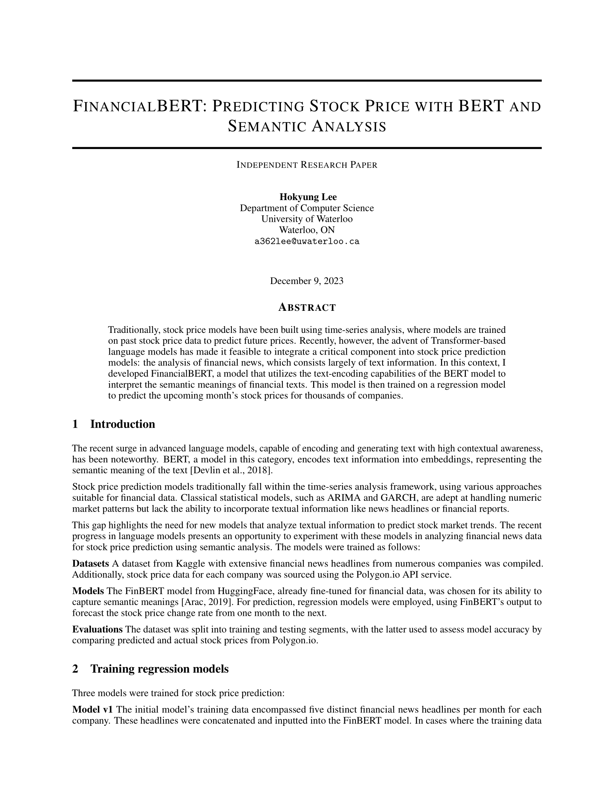
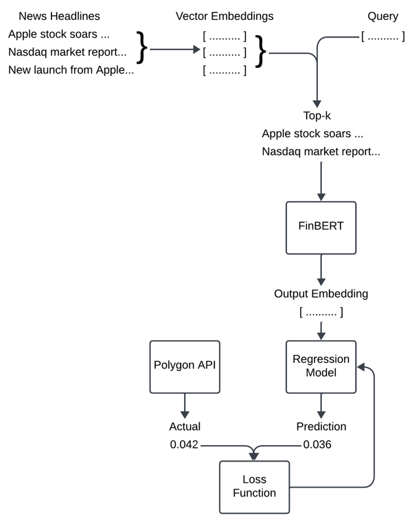
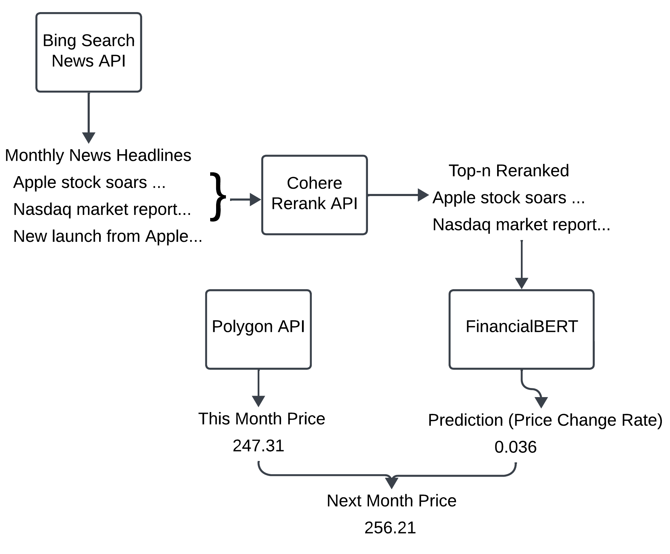
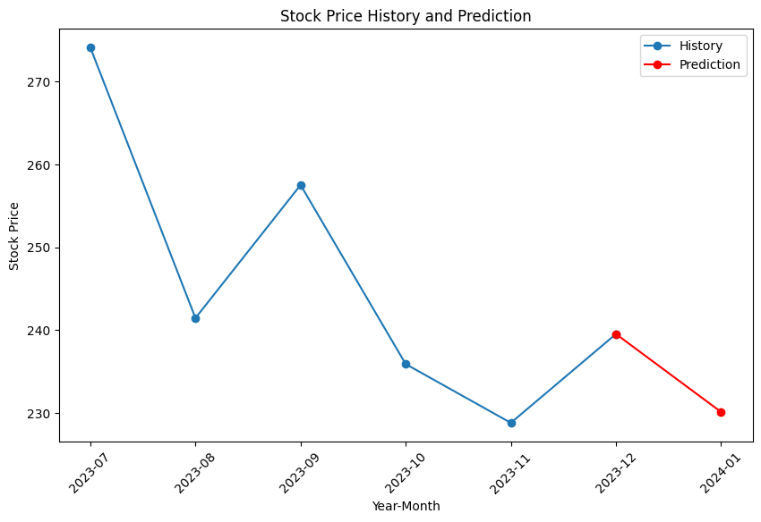
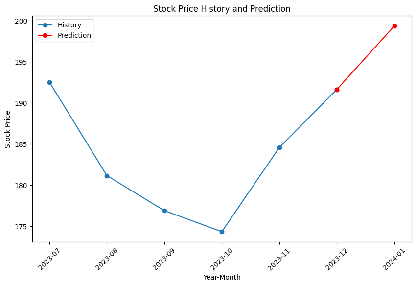

# FinancialBERT



### About

- Stock price prediction model built using BERT and regression model trained on textual financial news data.
- RAG system built on top of trained model for interactable application for predicting next month's stock price from real-world financial news headlines.
- Demonstrates an alternative approach to the current time-series models for financial predictions using NLP.
- Research paper published on [ResearchGate](https://www.researchgate.net/publication/376356600_FinancialBERT_Predicting_Stock_Price_with_BERT_and_Semantic_Analysis).
<a href="https://www.researchgate.net/publication/376356600_FinancialBERT_Predicting_Stock_Price_with_BERT_and_Semantic_Analysis">
    
</a>

### Project Structure

- `finance_bert_monthly_data_engineering.ipynb` contains code to extract training data from financial news datasets from Kaggle and stock price history data from Polygon.io.
- `data.zip` contains all training data (no need to run the above notebook yourself) called `stock_data.zip` and `cleaned_training_data.jsonl`, as well as `tickers_and_names.csv` file needed for the RAG system.
- `financial_bert_monthly_prediction_training_from_embedding_v1.ipynb` contains source code to train the Model v1 from the research paper.
- `financial_bert_monthly_prediction_training_from_embedding_v2.ipynb` contains source code to train the Model v2 from the research paper (the model used for the RAG system).
- `financial_bert_monthly_prediction_training_from_probabilities_top_5_k.ipynb` contains source code to train the Model Top 5k from the research paper.
- `financial_bert_rag_system.ipynb` contains source code to run the Streamlit app for interactive stock price prediction app.
- Additionally, the trained regression model weights can be downloaded from my Google Drive: [https://drive.google.com/file/d/1g-HDbEMdaMrWHFKxjE7UmLu_Tf8kwhqB/view?usp=sharing](https://drive.google.com/file/d/1g-HDbEMdaMrWHFKxjE7UmLu_Tf8kwhqB/view?usp=sharing)

### Model Training

- The best-performing model, Model v2, was trained by (1) selecting the top-k headlines from each month in the dataset and concatenating them, (2) feeding them to the FinBERT model, (3) and using a regression model to convert the output embedding to a single numeric value representing stock price change rate from the current month to the next month.
- The architecture for the training loop is displayed below:

- Please take a look at the research paper for more details.

### RAG System

- Additionally, a RAG system was built to predict stock prices with real-world data.
- The system allows the user to select a company, where (1) relevant financial news headlines are fetched from Bing Search News API, (2) the headlines are fed through Cohere Rerank API to select the top-k headlines, (3) and concatenated/feed into the trained FinancialBERT system from the `Model Training` section above to produce the stock price change rate prediction.
- The architecture for the RAG system is displayed below:

- Please take a look at the research paper for more details.

### Prediction Examples

> Example 1: Tesla

*Cohere Reranked Articles*  
```
1. It seems the most impactful event occurred with a major Tesla peer. China&#39;s Nio reported its third-quarter results, revealing still robust (46% year-over-year) growth in EV sales. Net losses -- both according to GAAP and non-GAAP (adjusted) standards -- were deeper than they were in the year-ago period, but not worryingly so.
2. A futuristic new EV truck is not enough of an innovation or financial incentive to base an investment decision on TSLA stock.More From InvestorPlace ChatGPT IPO Could Shock the World, Make This Move Before the Announcement Musk’s “Project Omega” May Be Set to Mint New Millionaires.
3. The long-awaited launch of the Cybertruck failed to boost Tesla stock after pricing for the electric vehicle came in much higher than initially promised.
4. This time has also come to mean something for Tesla investors: wondering about Elon Musk’s potential sales of Tesla stock.
5. Tesla Cybertruck order holders disappointed by the high prices can look forward to a more affordable Tesla model coming soon.
```
*Stock Price History and Prediction*  


> Example 1: Tesla

*Cohere Reranked Articles*  
```
1. New data from a major Apple supplier and Wall Street analysts pushed back against bearish calls around softening demand for the tech giant’s devices and services. It’s no wonder Apple (AAPL) shares have clawed their way back in recent weeks toward record highs.
2. In the world of <b>finance</b>, certain stocks can captivate investors and drive ... that have had a significant impact on market returns. These stocks include <b>Apple</b> <b>Inc</b>., Microsoft Corp., Amazon.com <b>Inc</b>., Nvidia Corp., Alphabet <b>Inc</b>., Tesla <b>Inc</b>., and Meta ...
3. No significant <b>news</b> for in the past two years. Key <b>Stock</b> Data P/E Ratio (TTM) The <b>Price</b> to Earnings (P/E) ratio, a key valuation measure, is calculated by dividing the <b>stock</b>&#39;s most recent closing ...
4. Despite a turbulent market, the shares of <b>Apple</b> <b>Inc</b> ... <b>Apple</b>’s <b>stock</b> has shown a commendable resilience, marking its second consecutive day of gains. Although it closed $6.99 below its 52-week high on July 19th, the company’s <b>stock</b> <b>price</b> remains ...
5. The main news out on Apple in the early part of the month was its fourth-quarter earnings report. It showed solid numbers, topping estimates on the top and bottom lines, but the stock actually pulled back slightly on the news, falling 0.6% on Nov. 3 after two straight days of strong gains to open the month.
```
*Stock Price History and Prediction*  

